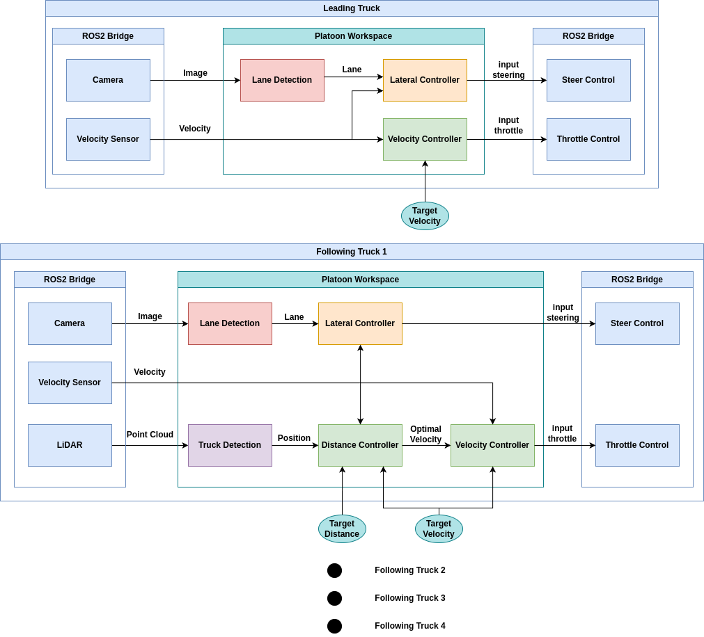

# platoon_ws
This Repository is for Developing & Testing SEA:ME [ADS_Truck-Platooning](https://github.com/SEA-ME/ADS_Truck-Platooning) Project.


ROS2 Bridge is from [carla-virtual-platoon](https://github.com/AveesLab/carla-virtual-platoon) Interface.

## Structure


## Features
### [Lane Detection](src/lane_detection/README.md)
### [Truck Detection](src/truck_detection/README.md)
### [Lateral Control](src/lateral_control/README.md)
### [Longitudinal Control](src/longitudianl_control/README.md)

---

## User Guide 

### Install
- Clone Repository
    ```bash
    git clone https://github.com/MC00614/platoon_ws.git
    ```
- Build
    ```bash
    colcon build --symlink-install
    ```
- Source (Option 1)
    ```bash
    # Need to source for new terminal
    source install/setup.bash
    ```
- Source (Option 2)
    ```bash
    # or add in bashrc
    vi ~/.bashrc
    # Add this line at the bottom of bashrc
    source install/setup.bash
    # Source bashrc
    source ~/.bashrc
    ```


### Launch
- Launch all together (Option 1)
    ```bash
    # Set One Truck
    ros2 launch platoon_launch platoon_launch.launch.py
    ```
    ```bash
    # or set Number of Trucks
    ros2 launch platoon_launch platoon_launch.launch.py NumTrucks:=3
    ```

- Launch Seperately (Option 2)
    ```bash
    # in each terminal
    ros2 launch lane_detection lane_detection.launch.py
    ros2 launch lane_follower lane_follower.launch.py
    ros2 launch truck_detection truck_detection.launch.py
    ros2 launch longitudianl_control longitudianl_control.launch.py
    ```
    ```bash
    # You can set Number of Trucks for each launch
    ros2 launch lane_detection lane_detection.launch.py NumTrucks:=3
    ```