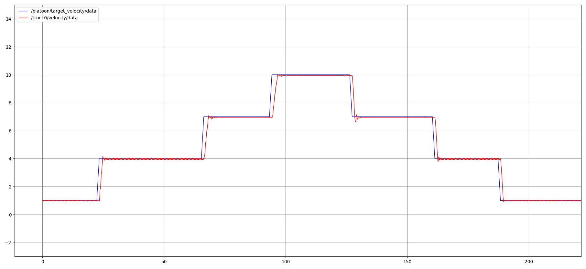

# Longitudianl Control

## Distance Controller
- `LQR (Linear Quadratic Regulator) Controller` is implemented to deal with between `distance error` and `velocity error` from reference (target) value.
- This controller is only running in `following trucks`, not in leading ones.
- Output of this controller is `optimal velocity` to reduce distance error while avoid collision.

## Velocity Controller
- `PID Controller` is working in every truck to calculate `optimal thrtolle` to reduce velocity error.
- For leading truck, `target velocity` is used.
- For following trucks, `optimal velocity`, which is calculated by `Distance Controller`, is used.

## Dependency
- Python [control](https://pypi.org/project/control/) package